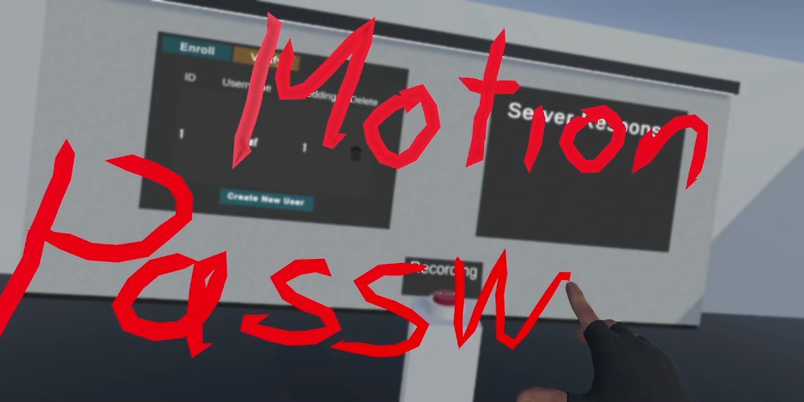

# Motion Passwords



This repository hosts the code for the paper "Motion Passwords" by Rack et al., which will be published in the Proceedings of the 30th ACM Symposium on Virtual Reality Software and Technology (VRST 2024). The paper introduces Motion Passwords, a novel biometric verification method for VR environments, where users verify their identity by writing a chosen word in 3D space.

## Setup

After cloning, make sure to install [DVC](https://dvc.org/doc/install) and pull all data files with `dvc pull`.

## Repository Structure

The repository is structured into two subfolders:
- **preprocessing**: Contains the code for preprocessing the Motion Password dataset.
- **training**: Includes machine learning and evaluation code used in the paper.

Both subfolders have dedicated README files with detailed instructions.

## Related Repositories

- [Motion Password Dataset]([link](https://github.com/cschell/MoPs-Dataset)): This repository hosts the Motion Password dataset used in the study.
- [Unity Prototype (coming soon)](#): This repository hosts the Unity prototype introduced in the paper.

## Citation

Please use the following BibTeX entry to cite this work:

```bibtex
@conference{rack2024motion,
  title        = {Motion Passwords},
  author       = {Rack, Christian and Schach, Lukas and Achter, Felix and Shehada, Yousof and Lin, Jinghuai and Latoschik, Marc Erich},
  booktitle    = {Proceedings of the 30th ACM Symposium on Virtual Reality Software and Technology},
  year         = {2024},
  series       = {VRST '24},
  address      = {New York, NY, USA},
  publisher    = {Association for Computing Machinery},
  note         = {accepted},
  doi          = {10.1145/3641825.3687711}
}
```

For more details, refer to the subfolder READMEs and the linked repositories.
